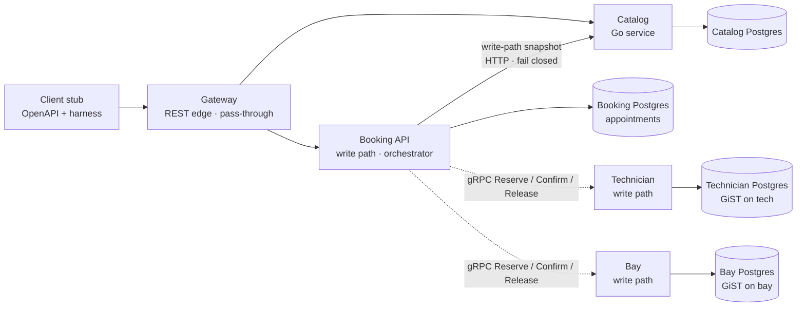
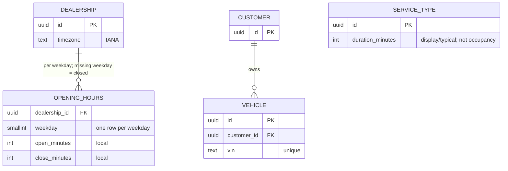
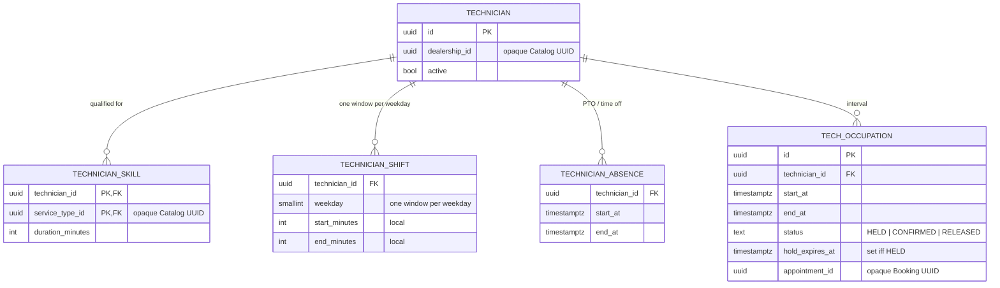
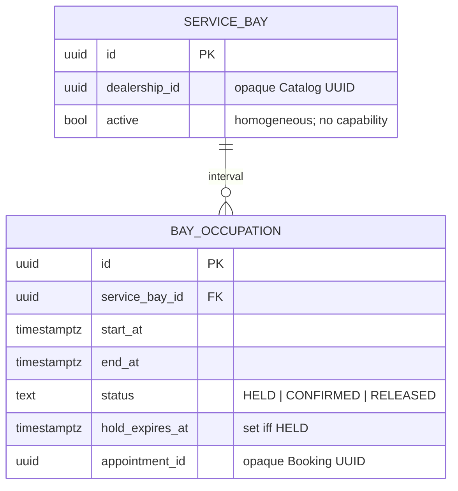
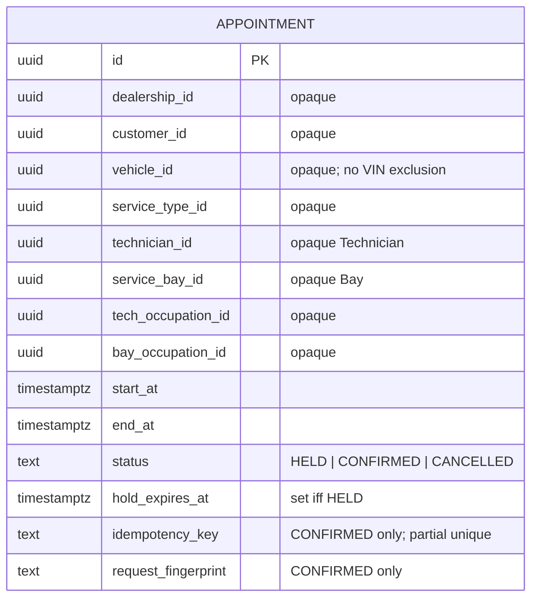
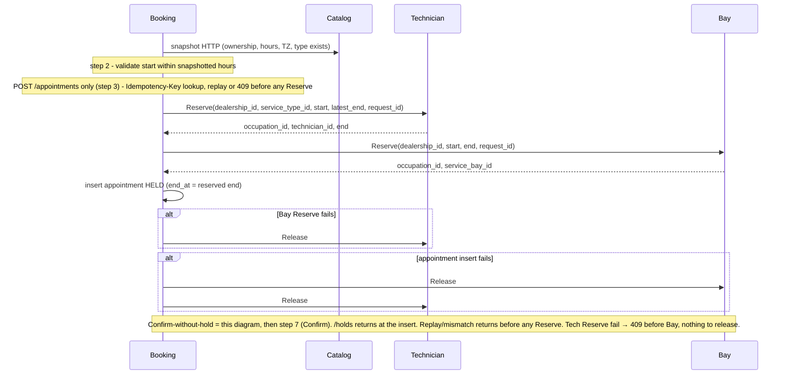

# Unified Service Scheduler — System Design

Scenario A (Ownership). A dealership service appointment is confirmed only when a **service bay** and a **qualified technician** are both free for the **entire** service interval.

**User lock (explicit):** occupancy is **two allocators**. Technician owns technician intervals; Bay owns bay intervals. Booking orchestrates and stores the appointment. This is a saga. Silent overlap on **one** resource is still the failure that matters. A crash between reserve and compensate can still pin a resource for the hold TTL when there is no Booking row for the sweeper to work from — not every crash is recovered in-request.

The client stays a stub (OpenAPI + harness). Catalog is implemented (Go service + Postgres, fail-closed reads). Implementation is the write path: **Technician + Bay + Booking**. Scale is still **not** the hard part — O(10²) write QPS does not require this split; the split is a product/org choice.

---

**Contents**

- [Architecture](#architecture)
- [Capacity](#capacity-labeled-assumptions-not-keyloop-published-traffic)
- [Data model](#data-model)
- [API sketch](#api-sketch)
- [Data flow](#data-flow)
- [Technologies](#technologies)
- [Observability](#observability)

## Architecture



Clients hit the **Gateway**, which routes HTTP to **Catalog / Booking** only; **Technician** and **Bay** are not public — only Booking calls them, over unary gRPC (Reserve / Confirm / Release), and only on the write path.

### Component roles

| Component | Role |
|---|---|
| Client stub | Exercises HTTP. No booking rules. |
| Gateway | Thin REST reverse-proxy: Catalog reads + Booking `/holds` `/appointments`. Forwards `Idempotency-Key` / `X-Request-Id`, does **not** apply idempotency (that stays on Booking confirm). Routes HTTP to Catalog and Booking only — **no** edges to Technician or Bay; not JWT, not a BFF, not an occupancy aggregator, not the saga coordinator. Liveness only, no DB. |
| Catalog | Dealerships, IANA timezone, opening hours, service types (`duration_minutes` — client display/typical, **not** the occupancy claim), customers, vehicles. Own Postgres. **Non-claim** reads may be cached; the write path does not use that cache. |
| Technician | Technicians, skills, shifts, PTO/absences, tech interval holds. Owns the technician GiST. Picks one free qualified tech for an interval; the skill row's `duration_minutes` sets the occupancy end. Fail closed if down on the write path. |
| Bay | Service bays, bay interval holds. Owns the bay GiST. Homogeneous bays. Picks one free bay. Fail closed if down on the write path. |
| Booking | Appointment record, Catalog snapshot (ownership, hours, IANA TZ — not occupancy duration), saga: reserve tech → reserve bay → persist appointment `HELD`; confirm = allocator `Confirm` tech then bay, then `UPDATE … CONFIRMED`. Compensate (Release bay → tech) on any failure — in request, or via the Booking sweeper (expired `HELD`: CAS `CANCELLED` then Release; bounded `CANCELLED` retry). `Confirm` on a missing/expired occupation fails; `Release` is idempotent. Idempotency on **confirm**. 120s hold. Does **not** run occupancy SQL. |

**GiST still does not scale out** inside each allocator. Extra Technician or Bay pods do not add occupancy capacity; each still has **one write primary**. Horizontal scale is Catalog caches on catalogue reads. Sharding each GiST by `dealer_id` is a future option; not now.

### Real-time availability

The brief's check **is** Technician reserve + Bay reserve on their **write primaries** (hold, or confirm-without-hold): one `tstzrange` — the **returned** skill interval (`end = start + skill.duration_minutes`), not catalog duration; skill, whole-interval shift with `end <= latest_end`, and no overlap/PTO on the tech; a free bay. **Not** Booking occupancy SQL. **Not** `GET /slots`. **Not** Redis. **Not** `SERIALIZABLE` as authority. **Not** `SELECT FOR UPDATE` on resource rows.

**Promote-in-place** is not a second claim: no re-reserve on `holdId`. The check already ran at hold; live unexpired `HELD` occupations stay in GiST.

Catalog **non-claim** cache may stay; the write path does not use it.

## Capacity (labeled assumptions, not Keyloop-published traffic)

Assumed: 20 000 dealers × 50 **confirmed bookings** / dealer / day = **1 000 000 writes/day**; a confirm is Catalog GETs + two reserve writes + one appointment write. Counts below are confirmed bookings. **20 000** is order-of-magnitude for a Keyloop-**global** footprint, not the US dealer count. **50 / dealer / day** is bay-capped high online-mix **stress**, not today's phone-majority mix.

| Window | Write QPS |
|---|---|
| 24h mean | 1e6 / 86400 ≈ **12** |
| 8h shop day | 1e6 / 28800 ≈ **35** |
| Peak (×3–5 on the shop-day mean) | **O(10²)** |

Not a high-QPS design. The bottleneck is **local contention** at one dealer, one interval. Two allocators add **coordination** (latency, compensation, pinned holds), not write throughput. Hold TTL stays **120s**. Timing constants, all fixed with no env override: sweeper tick 10s, hold TTL 120s in SQL, Catalog client timeout 3s, allocator reserve retry ×3. Worst-case pin on the Booking-row path ≈ TTL + one sweeper tick.

## Data model

Four logical databases on one Postgres 16 (compose + chart create them via `init-databases.sql`; each service keeps its own DSN). No distributed foreign keys. No events to sync ids. Catalog UUIDs on other DBs are **opaque** (attributes, not edges).

**Catalog Postgres** — identity only. `ServiceType.duration_minutes` is display/typical, not the occupancy claim. Missing opening-hours weekday = closed.



**Technician Postgres** — instants `timestamptz` (UTC).

- **TechnicianSkill:** presence of `(technician_id, service_type_id)` = qualified — no levels. That row's `duration_minutes` (>= 1) is occupancy length. Booking does **not** join skills. No skill CRUD; `service_type_id` is not stored on occupations; no bay capability.
- **TechnicianShift:** one window per weekday; must cover the whole interval.
- **TechnicianAbsence:** PTO/time-off; `NOT EXISTS` in the tech claim — not a second GiST. Dated time-off is more rows, no `reason` column. Lunch is a shift hole, not an absence.
- **TechOccupation:** `appointment_id` is an opaque Booking UUID, not an FK.



**Bay Postgres**

- **ServiceBay:** homogeneous — no capability, no tech×bay.



**Booking Postgres** — no occupancy edges; no GiST.

- **Appointment:** `idempotency_key` + `request_fingerprint` only on **`CONFIRMED`**. Partial unique on `idempotency_key` WHERE not null and `CONFIRMED`. Holds do not honour the key.



**Exclusion constraints.** Each allocator, on its occupation table. `CREATE EXTENSION btree_gist`.

Technician:

```sql
EXCLUDE USING gist (
  technician_id WITH =,
  tstzrange(start_at, end_at, '[)') WITH &&
) WHERE (status IN ('HELD', 'CONFIRMED'));
```

Bay:

```sql
EXCLUDE USING gist (
  service_bay_id WITH =,
  tstzrange(start_at, end_at, '[)') WITH &&
) WHERE (status IN ('HELD', 'CONFIRMED'));
```

Bounds are half-open `'[)`. `RELEASED` / Booking `CANCELLED` drop the row out of the predicate. No `vehicle_id` exclusion — same-VIN overlap is a **product residual**. PTO is `TechnicianAbsence` + `NOT EXISTS` in the tech claim, **not** a third GiST. Unavailability is two shapes — claim rows (GiST) and predicates in the tech claim — never a table per label.

## API sketch

| Method | Path | Owner | Notes |
|---|---|---|---|
| `GET` | `/dealerships`, `/service-types`, `/customers/:id/vehicles` | Catalog | Catalogue / ownership. |
| `POST` | `/holds` | Booking | Snapshot Catalog (fail-closed), then saga reserve tech → bay → appointment `HELD` 120s. Compensates on failure. **Not idempotent.** |
| `POST` | `/appointments` | Booking | Same saga (or promote-in-place). Optional `holdId`. `Idempotency-Key` recommended — confirm only. Occupancy `end` comes from Technician Reserve. |
| `GET` | `/appointments/:id` | Booking | Confirmation record. Booking primary. |
| `DELETE` | `/appointments/:id` | Booking | Cancel; release both occupations. |

Allocator **occupations are gRPC** (Booking → Technician / Bay: Reserve / Confirm / Release), not public HTTP. Clients talk to Booking (and Catalog reads). They do **not** pick a named tech or bay. No authentication. Get/cancel are **IDOR**-able.

Internal gRPC sketch — implemented in `backend/shared/proto/` (buf generates `backend/shared/gen/`):

- **Technician.**
  `Reserve(dealership_id, service_type_id, start, latest_end, request_id)` → `occupation_id, technician_id, end` — `end = start + skill.duration_minutes`; `latest_end` is the shop-close **ceiling**, not occupancy end.
- **Bay.**
  `Reserve(dealership_id, start, end, request_id)` → `occupation_id, service_bay_id` — `end` is the **returned** tech occupancy end, forwarded by Booking; Bay never sees `latest_end` or catalog duration; **no** `service_type_id` (bays are homogeneous).
- **Both.** `Confirm(occupation_id)` and `Release(occupation_id)` are split semantics, all unary.
  `Confirm`: `HELD` → `CONFIRMED`; already `CONFIRMED` → no-op; **missing / expired `HELD` / `RELEASED` → fail** (allocator error; Booking → `409`).
  `Release`: `HELD` or `CONFIRMED` → `RELEASED`; already `RELEASED` or missing → no-op (`CONFIRMED` must stay releasable — cancel, half-promote, sweeper).
  Occupancy `end` is skill-derived inside Technician — not a Booking snapshot field, never a client field; allocators never call Catalog.
  `request_id` travels **in the message**: it is the pick-hash salt (`ORDER BY hash(id, request_id)`), **not** Reserve idempotency — holds stay non-idempotent. Tracing stays gRPC **metadata**; no second id. No `appointment_id`, no `duration_minutes`, no TTL on Reserve — the 120s hold stays allocator-owned. Allocator failure → Booking `409`; no status-code taxonomy.

---

## Data flow

Duration is never taken from the client: Booking stores `end_at` from the **Technician Reserve** response; Catalog `duration_minutes` is display/typical only.

| HTTP | Runs | Returns |
|---|---|---|
| `POST /holds` | 1–2, 4–6 | `HELD`; never Confirm |
| `POST /appointments` (no `holdId`) | 1–6 then 7 | `CONFIRMED` or `409` |
| `POST /appointments` (`holdId`) | 3 then 7 | `CONFIRMED` or `409`; no re-reserve |

Reserve saga — steps 1–6 below. Shared by `/holds` and confirm-without-hold (holds skip step 3). Promote skips this diagram. gRPC Confirm is step 7 — not pictured.



### Reserve (steps 1–6)

Hold and confirm never call a grid — there is no slot grid. **Fixed order:** Catalog snapshot → **Technician reserve** → **Bay reserve** → Booking row; compensate in reverse (bay then tech), which frees the newest pin first.

1. **Fail closed** Catalog GETs (no cache): ownership, hours, IANA TZ, service type **exists**. Catalog down/404 → reject. Catalog `duration_minutes` is display/typical — never the occupancy claim. TOCTOU accepted.
2. Reject a start not strictly in the future or **outside snapshotted hours**. Compute `latest_end` = that weekday's shop close as `timestamptz` — hours **ceiling**, not occupancy end.
3. **Confirm endpoints only** (`POST /appointments`): `Idempotency-Key` lookup on Booking `CONFIRMED`. Same fingerprint → replay. Mismatch → `409`. Holds skip this step and are not idempotent.
4. Technician: unary gRPC **Reserve** — one `INSERT … SELECT` **on that allocator's write primary**: active tech at the dealership, a `TechnicianSkill` row for the snapshotted `service_type_id` supplying `end = start + skill.duration_minutes`, shift covers `[start, end)`, no overlapping occupation or absence, `end <= latest_end`, `ORDER BY hash(id, request_id) LIMIT 1`. Never SELECT occupancy on a replica then INSERT on the primary. Failure → `409`, no bay call.
5. Bay: unary gRPC **Reserve** with the returned `[start, end)` — active homogeneous bay, on Bay's write primary. Failure → gRPC `Release` the tech occupation, then `409`.
6. Booking inserts **`HELD` only** pointing at both occupation ids, with `end_at` = the reserved end — for hold **and** confirm-without-hold. Never insert `CONFIRMED` here. `idempotency_key` / `request_fingerprint` are **not** stored on this insert. Insert fails after both reserves → Release bay then tech (gRPC `Release` in reverse saga order).

Expired `HELD` occupations still occupy GiST until that allocator `DELETE`s them — that is Recovery, not this request.

### Confirm (step 7)

Step 7 is a **phase**. Confirm-without-hold runs 1–6 then 7 in the **same** `POST /appointments`. Promote (`holdId`) is a **second** request (up to 120s later). **`POST /holds` returns after step 6 and must not Confirm.**

- The row is already `HELD` (promote: existing; confirm-without-hold: just inserted). Live unexpired `HELD` occupations stay in GiST — the check already ran at reserve.
- Sequential gRPC **Confirm** tech then bay moves each occupation HELD → CONFIRMED in place on its allocator — **no second claim / no re-reserve**. Do not re-run skill/shift/PTO checks; do not re-read skill duration; do not change tech, bay, or interval.
- Booking `UPDATE … SET status=CONFIRMED WHERE status=HELD`. `idempotency_key` + `request_fingerprint` land **only** on this UPDATE (never on the `HELD` insert).
- **Any Confirm failure → Release both stored occupation ids** (idempotent Release), then Booking `409` — **never** a replacement pair.
- Missing / expired / `RELEASED` occupation → allocator Confirm fails (see gRPC sketch) → Booking `409` — the Confirm failure is the detector; no extra check.

### Cancel

Booking sets `CANCELLED`, then calls gRPC `Release` on both occupations (bay then tech). Release is idempotent: cancel of an already-`CANCELLED` appointment is a re-Release and succeeds. `DELETE` on a `HELD` hold takes the same path: row to `CANCELLED`, then Release both. The slot becomes bookable when both Releases commit. Cancel then book can still lose the slot. The Booking sweeper retries bounded `CANCELLED` work (see Recovery).

### Recovery

Compensation happens in three layers, in order of how much row evidence exists:

- **In-request (live handler).** Reverse order as the diagram alts show (Bay fail → Release tech; insert fail → Release bay then tech); **any Confirm failure → Release both stored occupation ids** then `409`.
- **Booking sweeper (persisted rows).** Work item is the Appointment row plus its stored occupation ids — **no** outbox, no saga log, no allocator reads, no liveness RPC. Release bay then tech, using idempotent Release. Expired `HELD`: CAS first — `UPDATE … SET status=CANCELLED WHERE status=HELD AND hold_expires_at <= now()` — **then** Release both (Release-then-UPDATE could un-confirm a winning promote). GET returns the **stored** status: an expired `HELD` is still `HELD` until this CAS, then `CANCELLED`. The sweeper retries `CANCELLED` rows that still hold occupation ids until both Releases succeed, then clears the ids and stops — rows with no ids left are never swept. Promote of a `holdId` the sweeper already cancelled → `409`. Half-promote the other way (both Confirms land, then the row flip loses the CAS to the sweeper): the loser re-reads the row and Releases its own occupation ids in-request; a crash in that window is what the bounded `CANCELLED` retry is for.
- **Allocator reaper (no Booking row).** Each allocator runs a **periodic reaper** — always-on `DELETE` of expired `HELD` rows (`hold_expires_at <= now()`), not gated on contention. Separately, on Reserve `0` rows or GiST `23P01`, it deletes its own expired `HELD` rows — **three attempts total**, then `409`. Booking does not run that SQL. An expired `HELD` occupation still occupies GiST until that allocator `DELETE`s it. `CONFIRMED` occupations are never TTL-deleted. All TTL comparisons use the database `now()` on the one shared Postgres instance — there is no clock-skew story.

**Residual (accepted):** a crash **after a successful Reserve and before the Booking insert** leaves no appointment row for the sweeper — tech and bay stay pinned until the 120s TTL or the allocator reaper.

Not outbox: an outbox does not close the pre-insert hole (crash after Reserve, before any row), the Appointment row already is the work item, and O(10²) QPS does not justify the machinery.

### Concurrency

gRPC does not close the race; GiST does. Check-then-act across RPC still cannot make one resource safe — each allocator's GiST on **its** primary is the authority for that resource, and Booking's saga cannot replace it. The reaper and the GiST `23P01` retry remain **inside** each allocator, not behind Booking.

### Assumptions

- Exact-start booking; there is no slot grid. Back-to-back appointments are valid.
- One technician and one bay per appointment. Bays are homogeneous; no tech×bay affinity.
- Technicians do not float across dealerships. Skills do not expire. One shift window per weekday.
- PTO is `TechnicianAbsence` on Technician, in the tech claim, not a separate allocator.
- Opening hours stay Catalog (Booking snapshot + `latest_end`); allocators never read Catalog.
- New unavailability labels reuse the two shapes — claim rows or predicates in the tech claim; a new table only if owner or lifecycle differs. No plugin, no table per label.
- Saga compensation is best-effort, in three layers: in-request Release, the Booking sweeper on persisted rows, and TTL/reaper when no Booking row exists. Holds are not idempotent. Hold TTL 120 seconds. No outbox, no Kafka. No payment step.
- **Accepted residual (per-skill duration):** hash-pick then Bay `409` can fail while a shorter-duration qualified tech would have fit. Under uniform catalog duration, Bay fail meant no tech would have succeeded (same `tstzrange`); per-skill duration breaks that. **No retry, no bay-first, no prefer-shortest** — that would reverse the locked saga / hash pick. Occupation length stays frozen at hold (`end_at` / GiST), including promote.
- **Accepted residual (display vs booked):** catalogue display duration can disagree with booked `end_at`.
- Same-VIN overlap allowed (product residual).
- Catalog TOCTOU accepted (display only — occupancy comes from skill duration, frozen by the occupation at hold). Promote does not re-validate duration.
- No authentication. IDOR on Booking get/cancel.
- Bank holidays, overtime, loaner cars, waitlists, multi-tech jobs, sharding GiST: out of scope.

---

## Technologies

| Choice | Justification |
|---|---|
| PostgreSQL 16 + `btree_gist` on Technician and on Bay | Each allocator's range exclusion is still a DB primitive on **one** primary per resource. |
| Separate Catalog Postgres (logical DB) | Read-heavy identity; write path fail-closed. |
| Booking Postgres without occupancy GiST | Appointment is the business record, not the lock. |
| Go + pgx on the three write services | Claims are SQL; Booking is HTTP orchestration over **gRPC** to the allocators. |
| `timestamptz` + IANA TZ | Stored instants are unambiguous. |
| Gateway: Go REST edge (no pgx) | Thin reverse-proxy only: Catalog reads + Booking `/holds` `/appointments`; forwards `Idempotency-Key` / `X-Request-Id`; no DB, no aggregation. |
| gRPC (unary) Booking → Technician / Bay | Reserve / Confirm / Release between Booking and the two allocators only. Saga semantics unchanged; GiST stays the race authority. |

Not chosen: Redis occupancy; Kafka/outbox; `SELECT FOR UPDATE` on resource rows; `SERIALIZABLE` as authority; Kubernetes/Jenkins as the problem; Slots as a pre-claim; a gateway that aggregates holds.

---

## Observability

**Logs.** JSON, with `request_id` on every hop (gRPC **metadata** on Booking → allocator calls). Booking logs saga step + `409` code + dealership + interval; allocators log GiST `23P01`. Clients never see stack traces.

**Metrics**

| Signal | Meaning |
|---|---|
| `booking_total{result=confirmed\|unavailable\|contended\|replayed\|rejected\|compensated}` | Including compensate-after-partial-reserve. |
| `booking_saga_step_total{step=tech\|bay\|appointment,result=ok\|fail}` | Where the saga stopped. |
| `tech_exclusion_violations_total` / `bay_exclusion_violations_total` | GiST fired on that allocator. |
| `occupations_held_pinned_total` | Holds that reached TTL without Booking confirm/cancel (crash residual). |
| `catalog_failclosed_total` | Write path could not snapshot Catalog. |

**Tracing.** Optional OpenTelemetry across the saga hops. Off unless an exporter is set.

**Health.** Liveness probes take no dependencies; Gateway is liveness-only with no DB. Each write service's readiness pings its own primary.

Part 1 asked for a dedicated GenAI-in-design-phase section in this document; that review is in `docs/AI_LOG.md` ## System design.

---